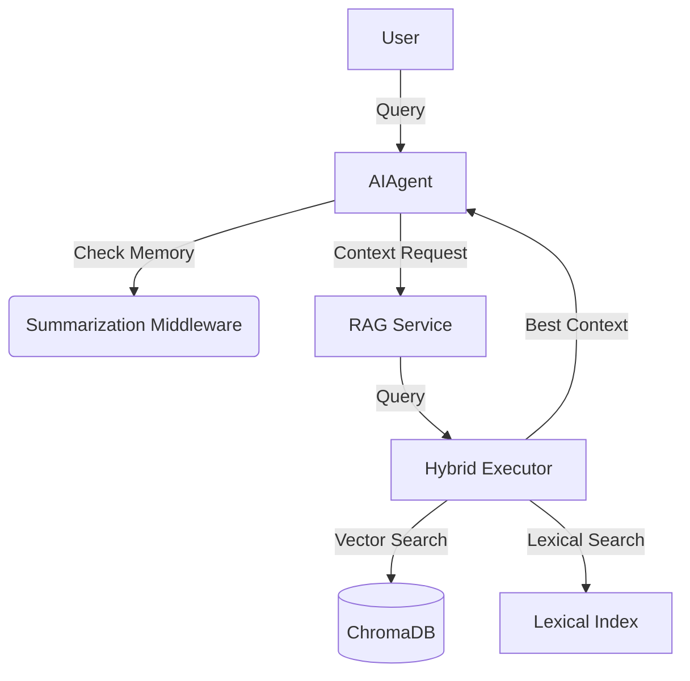

# 🧶 PokeConsultor

[](https://www.python.org/downloads/)
[](https://creativecommons.org/licenses/by-nc/4.0/)
[](https://github.com/langchain-ai/langchain)

Intelligent AI Consultant using **RAG (Retrieval-Augmented Generation)** to answer questions based on custom knowledge bases. While originally designed for data existing in the `data/` folder (RAG source), and named **PokeConsultor** as I plan to implement a **PokeAPI MCP server**, it is domain-agnostic and can be easily adapted to any context.

---

## 🌟 Key Features

- **🧠 Advanced Memory System**: Integrated with LangChain's `SummarizationMiddleware` for intelligent context management and automatic summarization of long conversations.
- **🔐 PII Protection Middleware**: Built-in `PIIMiddleware` stack (email, credit card, IP, API key, bearer token, database URL) with automatic redaction for inputs and tool results.
- **🔍 Hybrid Search**: Combines semantic (vector) search with lexical search using **Rank Fusion (RRF)**.
- **⚡ Incremental Embeddings**: Intelligent system that detects new, modified, or deleted files, processing only what's necessary.
- **📚 Multi-format Support**: Automatic loading of PDF, CSV, TXT, Markdown, and more via Factory Pattern.
- **🖥️ Dual Interfaces**: Choose between a powerful interactive CLI or a modern graphical interface built with **PySide6**.
- **🎯 LLM Profiles**: Granular model configuration for different roles (Executor, Supervisor, Default).

---

## 🚀 Quick Start

### Prerequisites
- Python 3.11 up to 3.13
- [uv](https://github.com/astral-sh/uv) (highly recommended)

### Installation

1. **Clone the repository**
   ```bash
   git clone https://github.com/frbelotto/PokeConsultor.git
   cd PokeConsultor
   ```

2. **Sync the environment**
   ```bash
   uv sync
   ```

3. **Configure Environment Variables**
   Create a `.env` file based on `.env.example`:

   ```bash
   cp .env.example .env
   ```

   Then edit at least:
   - `GROQ_API_KEY`
   - `DATA_PATH` (default: `data/`)
   - `POKEAPI_MCP_SERVER_URL` (use a URL string; if MCP is disabled, keep any valid placeholder URL)

4. **Run the application**
   ```bash
   uv run main.py
   ```

---

## 🏗️ System Architecture

The system is divided into decoupled modules for easy maintenance and expansion:



### Key Components

| Module | Responsibility |
| :--- | :--- |
| **`agents/`** | Conversation orchestration and LangChain/LangGraph integration. |
| **`services/rag/`** | Core retrieval engine, including hybrid search and RRF fusion. |
| **`services/memory.py`** | Checkpointing + middleware stack (PII redaction and optional summarization). |
| **`services/data_loaders/`** | Extensible system for processing various file types. |
| **`ui/`** | CLI and GUI (PySide6) implementations. |

### Tool Calling Flow (LangChain)

The retrieval capability is exposed as a LangChain tool named `retrieve_context`.
This keeps retrieval decoupled from response generation and allows the LLM to call
the tool multiple times whenever needed.

High-level flow:

1. User sends a question.
2. The agent decides if retrieval is necessary.
3. The agent calls `retrieve_context(query)`.
4. The tool runs hybrid retrieval (lexical + vector + RRF).
5. The tool returns structured output (`context`, `sources`, `retrieved_docs`).
6. The model synthesizes the final answer using only retrieved context.

---

## 📖 Usage

### CLI Mode (Default)
```bash
uv run main.py
```

### GUI Mode (Experimental)
```bash
uv run main.py --gui
```

### CLI Commands
- `memory`: View the current memory state and summaries.
- `clear_memory`: Reset session history.
- `debug`: Enable detailed retrieval and token logs.
- `exit`: Close the application.

---

## 🛠️ Technical Configurations

### Environment Variables (practical reference)

| Variable | Required | Notes |
| :--- | :---: | :--- |
| `GROQ_API_KEY` | Yes (for Groq models) | LLM provider key |
| `HF_TOKEN` | Optional | Enables authenticated Hugging Face downloads |
| `LLM_DEFAULT_*` | Yes | Default profile used by the agent |
| `LLM_PROFILE_EXECUTOR_*` | Yes | Executor profile |
| `LLM_PROFILE_SUPERVISOR_*` | Yes | Supervisor profile |
| `DATA_PATH` | Yes | Folder containing RAG source files |
| `CACHE_DIR` | Optional | Cache base path |
| `POKEAPI_MCP_ENABLED` | Optional | Enables/disables MCP usage |
| `POKEAPI_MCP_SERVER_URL` | Yes | Must be a URL string |
| `SUMMARIZATION_*` | Optional | Controls memory summarization |

> Note: `AGENT_RECURSION_LIMIT` is **not** an environment variable anymore.
> The recursion budget is computed internally by the agent based on middleware stack size.

### Hybrid Search Weights
The system uses Rank Reciprocal Fusion (RRF) to combine results. You can adjust search sensitivity within the search services if needed.

### Context Management
`RAGService` automatically calculates token limits based on the configured model (e.g., Llama-3.1, Mixtral), ensuring the final prompt never exceeds the LLM's context window.

### Agent Recursion Budget
To avoid `GraphRecursionError` with multiple middlewares, the agent computes a safe budget internally:

$$
   ext{effective\_recursion\_limit} = 20 + 4 \times \text{number\_of\_middlewares}
$$

This keeps runtime stable without extra tuning in `.env`.

---

## 🧯 Troubleshooting

### `GraphRecursionError: Recursion limit ... reached`

If this happens:

1. Ensure you are running the latest local code.
2. Restart the process (CLI/GUI) after updates.
3. Confirm your `.env` does **not** rely on legacy `AGENT_RECURSION_LIMIT` behavior.
4. Keep middleware stack changes synchronized with the codebase.

### Hugging Face warning about unauthenticated requests

Set `HF_TOKEN` in `.env` to increase rate limits and improve download reliability.

---

## 🤝 Contributing

Feedbacks and Pull Requests are very welcome! If you find a bug or have a feature idea, please open an Issue.

---

**Developed with ❤️ by [Fábio Radicchi Belotto](https://github.com/frbelotto)**
