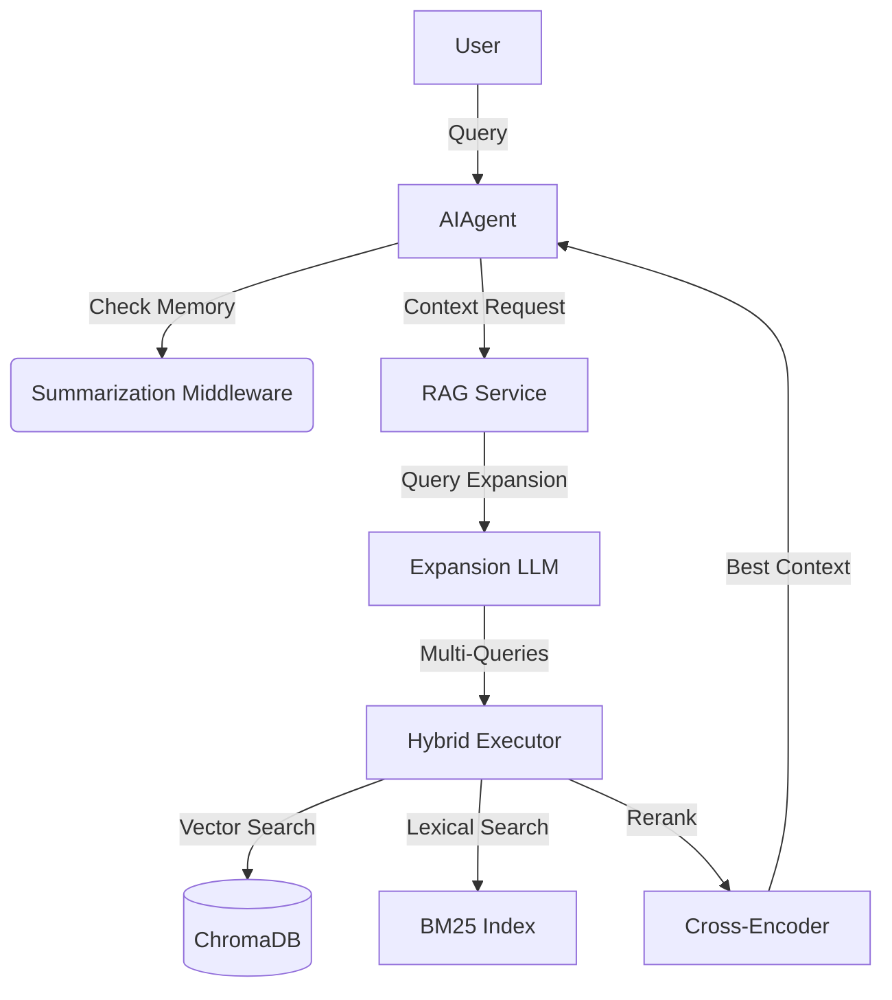

# 🧶 PokeConsultor

[](https://www.python.org/downloads/)
[](https://creativecommons.org/licenses/by-nc/4.0/)
[](https://github.com/langchain-ai/langchain)

Intelligent AI Consultant using **RAG (Retrieval-Augmented Generation)** to answer questions based on custom knowledge bases. While originally designed for data existing in the `data/` folder (RAG source), and named **PokeConsultor** as I plan to implement a **PokeAPI MCP server**, it is domain-agnostic and can be easily adapted to any context.

---

## 🌟 Key Features

- **🧠 Advanced Memory System**: Integrated with LangChain's `SummarizationMiddleware` for intelligent context management and automatic summarization of long conversations.
- **🔍 Elite Hybrid Search**: Combines semantic (vector) search with lexical search (BM25) using **Rank Fusion (RRF)** for maximum precision.
- **✨ Query Expansion**: Leverages LLMs to generate search variations, increasing retrieval coverage.
- **⚡ Incremental Embeddings**: Intelligent system that detects new, modified, or deleted files, processing only what's necessary.
- **📚 Multi-format Support**: Automatic loading of PDF, CSV, TXT, Markdown, and more via Factory Pattern.
- **🖥️ Dual Interfaces**: Choose between a powerful interactive CLI or a modern graphical interface built with **PySide6**.
- **🎯 LLM Profiles**: Granular model configuration for different roles (Executor, Supervisor, Default).

---

## 🚀 Quick Start

### Prerequisites
- Python 3.11 up to 3.13
- [uv](https://github.com/astral-sh/uv) (highly recommended)

### Installation

1. **Clone the repository**
   ```bash
   git clone https://github.com/frbelotto/PokeConsultor.git
   cd PokeConsultor
   ```

2. **Sync the environment**
   ```bash
   uv sync
   ```

3. **Configure Environment Variables**
   Create a `.env` file based on `.env.example`:

---

## 🏗️ System Architecture

The system is divided into decoupled modules for easy maintenance and expansion:



### Key Components

| Module | Responsibility |
| :--- | :--- |
| **`agents/`** | Conversation orchestration and LangChain/LangGraph integration. |
| **`services/rag/`** | Core retrieval engine, including hybrid search and reranking. |
| **`services/memory/`** | Persistence and history compression (summarization) management. |
| **`services/data_loaders/`** | Extensible system for processing various file types. |
| **`ui/`** | CLI and GUI (PySide6) implementations. |

---

## 📖 Usage

### CLI Mode (Default)
```bash
uv run python main.py
```

### GUI Mode (Experimental)
```bash
uv run python main.py --gui
```

### CLI Commands
- `memory`: View the current memory state and summaries.
- `clear_memory`: Reset session history.
- `debug`: Enable detailed retrieval and token logs.
- `exit`: Close the application.

---

## 🛠️ Technical Configurations

### Hybrid Search Weights
The system uses Rank Reciprocal Fusion (RRF) to combine results. You can adjust search sensitivity within the search services if needed.

### Context Management
`RAGService` automatically calculates token limits based on the configured model (e.g., Llama-3.1, Mixtral), ensuring the final prompt never exceeds the LLM's context window.

---

## 🤝 Contributing

Feedbacks and Pull Requests are very welcome! If you find a bug or have a feature idea, please open an Issue.

---

**Developed with ❤️ by [Fábio Radicchi Belotto](https://github.com/frbelotto)**
